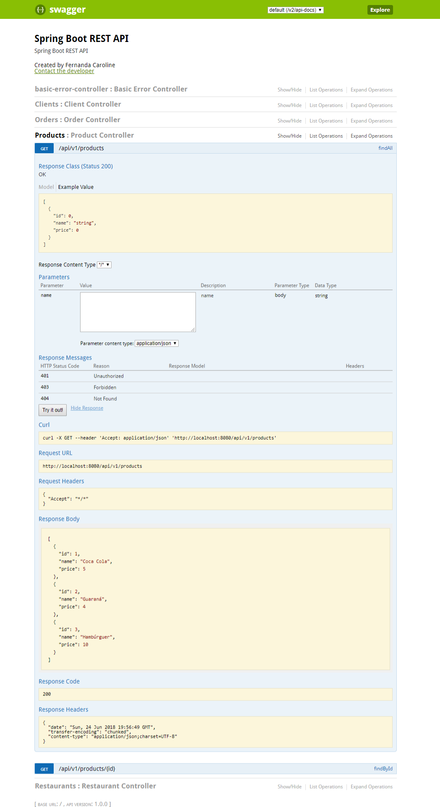

# Word Cup Rest API Skip the Dishes - Vanhackathon
Word Cup Application using SpringBoot and Swagger

This Rest API is a special version of Skip the Dishes for the world cup where the person can order food inside the stadium informing the place that is seated for example A5.

### Functionalities
- Interface OrderService: create, findAll, findByStatus, findById, updateStatus
- Interface ProductService: findAll, findByName, findById 
- Interface RestaurantService: findAll, findByName, findById
- Interface ClientService: findAll, findByName, findById

### Requirements

- Maven
- JDK 

### Install dependencies

- Spring Boot
- Spring Data JPA
- H2 Database
- Swagger 

```sh
$ mvn clean install

```

### Running Application

To build and start the server 

```sh
$ mvn clean spring-boot:run

```

### Using Swagger

You can test API in http://localhost:8080/swagger-ui.html




### TODO

Unit tests and verifies the percentage of tests with Code Coverage plugin for Eclipse
